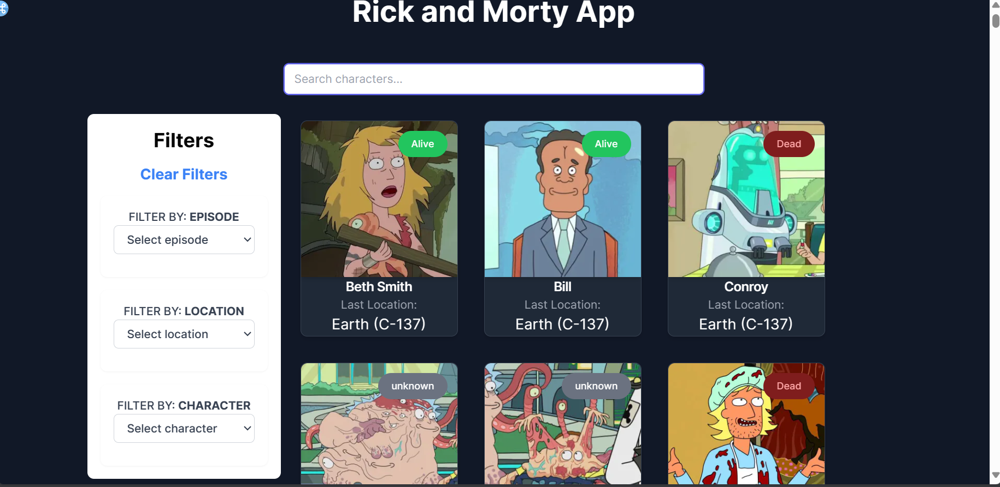
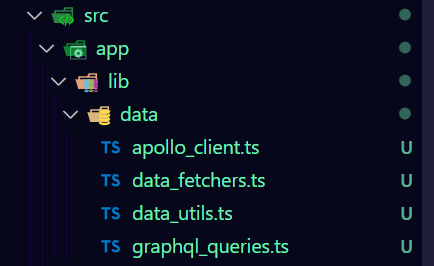
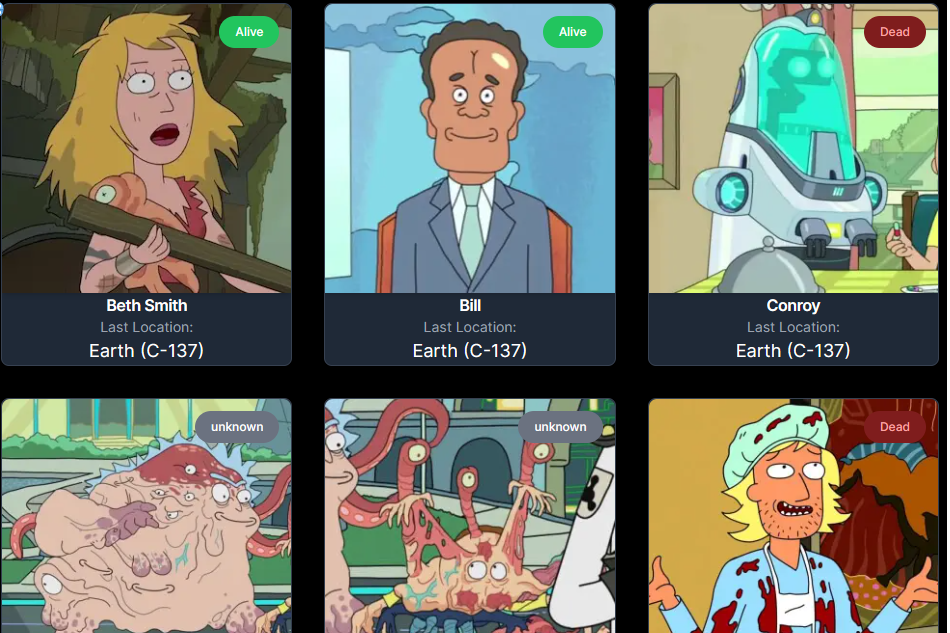
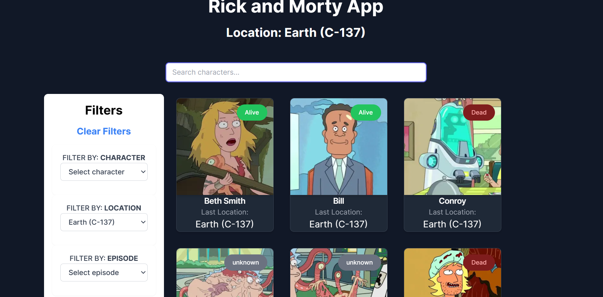
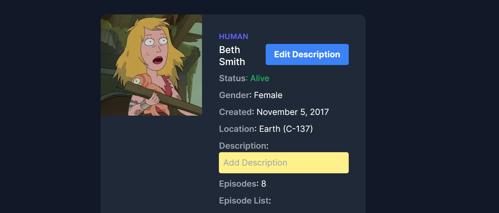
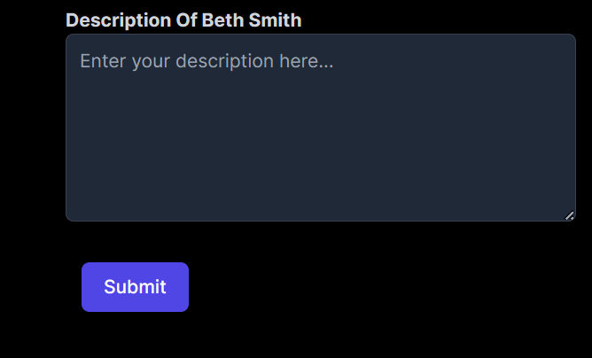

# Rick And Morty App



The Rick and Morty Character App allows users to browse information and add notes about characters from the popular animated TV series. This web application was built using Next.js, TypeScript, and other modern web development tools and techniques.

[TOC]

Link to deployment https://rick-morty-app-one.vercel.app/

## Getting Started

The project was first initialized with `npx create-next-app `


## Fetching Location Data

- Location data was retrieved from the `graphql` API at `https://rickandmortyapi.com/graphql`.
- Utilizing the `Graphql` endpoint streamlined the process by allowing comprehensive data retrieval in a single request, encompassing:
  - Locations
    - Residents' details including status, name, image, and episodes they appear in.

### Implementation Details:

- Established a dedicated `src/app/lib/data` folder to centralize all data-related operations.



- Key files within the folder include:

  - `data_fetchers.ts`: Functions designed for data retrieval.
  - `data_utils.ts`: Utilities facilitating data manipulation.
  - `apollo_client.ts`: Client setup to facilitate communication with the `graphql` API.
  - `graphql_queries.ts`: Defined queries tailored for fetching required data efficiently.

  

#### **changes**

> install apollo client:

```bash
npm install @apollo/client graphql @types/graphql
```

> `src\app\lib\data\data_fetchers.ts`

```typescript
import { getClient } from "./apollo_client";
import { GET_LOCATIONS } from "./graphql_queries";

const client = getClient();

//getting all locations
export async function fetchLocations(
    page: number,
    filter: {
        name: string;
    }
) {
    try {
        const result = await client.query({
            query: GET_LOCATIONS,
            variables: { filter, page },
            // fetchPolicy: 'no-cache',
        });

        return result;
    } catch (error) {
        console.error("Error fetching locations:", error);
        throw error;
    }
}

```


> `src\app\lib\data\apollo_client.ts`

```typescript
import { ApolloClient, HttpLink, InMemoryCache } from "@apollo/client";


const GRAPHQL_ENDPOINT =
    process.env.GRAPHQL_ENDPOINT ||  'https://rickandmortyapi.com/graphql';

let client: ApolloClient<any> | null = null;
export const getClient = () => {
    //create a new client if there is none
    // or if we are on the server
    if (!client || typeof window === "undefined") {
        client = new ApolloClient({
            cache: new InMemoryCache(),
            link: new HttpLink({
                uri: GRAPHQL_ENDPOINT,
            }),
        });
    }
    return client;
}

```


> `src\app\lib\data\graphql_queries.ts`

```typescript
import { gql } from "@apollo/client";

export const GET_LOCATIONS = gql`
query Locations($filter: FilterLocation, $page: Int) {
    locations(filter: $filter, page: $page) {
      results {
        residents {
          id
          image
          name
          status
          episode {
            name
            episode
            id
          }
          location {
            name
          }
        }
      }
      info {
        count
        pages
      }
    }
  }
`
```


## Implementing Search and Filter Functionality

To clarify, this step requires adding features to modify the retrieved data.

#### changes

` npm i @types/lodash lodash`


> #### `src\app\lib\data\data_utils.ts`

- The `data_utils.ts` file contains functions to facilitate the searching and filtering of residents based on various criteria:

- `imports`

  ```typescript
  import _ from 'lodash';
  import { Resident } from "../utils/definitions";
  import { fetchLocations } from './data_fetchers';
  ```

##### `searchResidentsByName`

```typescript

/**
 * Search residents by name.
 * @param residents - The array of residents to search.
 * @param query - The name to search for.
 * @returns An array of residents matching the search query.
 */
export function searchResidentsByName(residents: Resident[], query?: string): Resident[] {
    if (!query) return residents;

    const results = residents.filter(resident => {
        return resident.name.toLowerCase().includes(query.toLowerCase());
    });

    const uniqueResults = _.uniqBy(results, 'name');
    return uniqueResults;
}

```

##### `filterResidentsByEpisode`

```typescript
/**
 * Filter residents by episode.
 * @param residents - The array of residents to filter.
 * @param episodeName - The name of the episode to filter by.
 * @returns An array of residents that appeared in the specified episode.
 */
export function filterResidentsByEpisode(residents: Resident[], episodeName?: string): Resident[] {
    if (!episodeName) return residents;

    const results = residents.filter(resident => {
        return resident.episode.some(episode => episode.name.toLowerCase() === episodeName.toLowerCase());
    });

    const uniqueResults = _.uniqBy(results, 'name');
    return uniqueResults;
}

```

##### `filterResidentsByCharacter`

```typescript
/**
 * Filter residents by character name.
 * @param residents - The array of residents to filter.
 * @param characterName - The name of the character to filter by.
 * @returns An array of residents with the specified character name.
 */
export function filterResidentsByCharacter(residents: Resident[], characterName?: string): Resident[] {
    if (!characterName) return residents;

    const results = residents.filter(resident => {
        return resident.name.toLowerCase() === characterName.toLowerCase();
    });

    const uniqueResults = _.uniqBy(results, 'name');
    return uniqueResults;
}
```

##### `fetchResidentsWithFilters`

```typescript
/**
 * Fetch residents with filters.
 * @param page - The page number to fetch.
 * @param search - The name to search for.
 * @param location - The location name to filter by.
 * @param episode - The episode name to filter by.
 * @param character - The character name to filter by.
 * @returns An object containing the filtered residents and the total number of pages.
 */
export async function fetchResidentsWithFilters(page?: number, search?: string, location?: string, episode?: string, character?: string) {
    try {
        const filter = { name: location || '' }
        const result = await fetchLocations(page || 1, filter);
        const data = result.data; // Access the 'data' property
        const info = data.locations.info;
        let residents = _.flatMap(data.locations.results, location => location.residents);
        residents = filterResidentsByEpisode(residents, episode);
        residents = filterResidentsByCharacter(residents, character);
        residents = searchResidentsByName(residents, search || undefined);
        return { data: residents, pages: info.pages }; // Add a comma between searchResidents and info.pages
    } catch (error) {
        // Handle error
    }
}

```


## Displaying Location Data

These changes ensure a more intuitive and engaging user experience.

#### Changes

`npm install react-intersection-observer --save` - to be used in pagination by aiding fetching data when on scrolls

- Created the folder `src\app\ui`
  - Holds ui components

##### [CharacterCard](src/app/ui/residents/character-card.tsx)

> `src/app/ui/residents/character-card.tsx`

This component, named is designed for displaying information about a character in a user interface. 

**Key Features:**

- **Image Display**: The component includes an image section to showcase the character's visual representation.
- **Information Display**: It provides details such as the character's name and last location.
- **Status Badge**: There's a status badge indicating whether the character is alive, dead, or their status is unknown.
- **Skeleton Loading**: To enhance user experience, a skeleton loading animation is displayed while the character information is being fetched.

##### [CharacterCardList](src/app/ui/residents/character-card-list.tsx)

> `src/app/ui/residents/character-card-list.tsx`

This component is designed to display a list of character cards.

**Key Features:**

- **Pagination:** Automatically loads more characters as the user scrolls down the page utilizing `react-intersection-observer`.
- **Filtering:** Supports filtering characters based on search terms, locations, episodes, or specific characters.
- **Individual Character Links:** Each character card links to a dedicated page for more details.
- **Loading State:** Provides visual feedback while more characters are being loaded.
- **Error Handling:** Displays a message if no characters are found.

##### [Skeleton Components](src/app/ui/skeletons.tsx)

> `src/app/ui/skeletons.tsx`

These components provide skeleton loading animations to enhance the user experience while content is being fetched. 


##### [Server Action For Filtering](src/app/lib/utils/actions.ts)

> `src/app/lib/utils/actions.ts`

```typescript
"use server";

import { fetchResidentsWithFilters } from "../data/data_utils";

export async function getFilteredResidents({
    page = 1,
    search,
    location,
    episode,
    character
}: {
    page?: number
    search?: string | undefined
    location?: string | undefined
    episode?: string | undefined
    character?: string | undefined
}) {
    const residents = await fetchResidentsWithFilters(page, search, location, episode, character);
    return residents;
}
```


This code defines an asynchronous function named `getFilteredResidents` that fetches and filters resident data. It takes optional parameters to specify filtering criteria.

**So far**




## Implementing Search and Filter Display

- In [graphql_queries.ts](src/app/lib/data/graphql_queries.ts) appropriate queries for fetching all locations, episodes and characters were added. This will aid in getting the data that is to be displayed in the filters section.
- In [data_fetchers.ts](src/app/lib/data/data_fetchers.ts) a function for fetching all data given a graphql query was added.

##### [Search Component](src/app/ui/search.tsx)

>  `src/app/ui/search.tsx`

`npm i use-debounce` to delay the execution of the search function.

- The component accepts a single prop `placeholder` of type string, which is used as the placeholder text in the search input field.
- The interesting feature is that the `searchParams` in the `url` are used to hold the state of the search.

- It uses several hooks from Next.js and React:
  - `usePathname`, `useRouter`, and `useSearchParams` from Next.js to handle URL and navigation.
  - `useCallback` from React to memoize the callback function for the search input field.
  - `useDebouncedCallback` from the `use-debounce` package to delay the execution of the search function until 400 milliseconds have passed since the last invocation.
- The `handleSearch` function updates the URL's search parameters based on the input value and triggers a navigation refresh.

##### [Filter Component](src/app/ui/filter/filters.tsx)

>  `src/app/ui/filter/filters.tsx`

The component is designed to provide a filter functionality in a web application built with Next.js.

Detailed Explanation:

1. The component accepts three props: `locations`, `episodes`, and `characters`, each of which is an array of `AccordionItem` objects.
2. It uses several hooks from Next.js: `usePathname`, `useRouter`, and `useSearchParams` to handle URL and navigation.
3. The `clearFilters` function is defined to remove all filters from the URL search parameters. It creates a new `URLSearchParams` object from the current search parameters, removes each filter key if it exists, and then replaces the current URL with the updated search parameters.

**So far**




## Resident Details and Notes Persistence

Upon tapping on a resident, users will be directed to a screen displaying the resident's details. Here, they can access a form to add persistent notes about the character.

### Implementing character detail page

- Added a `graphql`  query `GET_CHARACTER`  in  [graphql_queries.ts](src/app/lib/data/graphql_queries.ts) to aid in fetching data of a single character
- Added a function `fetchCharacterById` in [data_fetchers.ts](src/app/lib/data/data_fetchers.ts)  to fetch a single character data

#### Configuring  Prisma for data storage

- Installed `prisma` to manage the local Postgres database that stores the notes on character

  ```bash
  npm i prisma, @prisma/client
  ```

- Initialized prisma

```bash
npx prisma init #generates a .env file that one can configure database on
```

- Add model of database

> [schema.prisma](prisma/schema.prisma) `prisma/schema.prisma`

```sql
model Character {
  id          Int      @id
  description String
  name        String
  createdAt   DateTime @default(now())
  updatedAt   DateTime @updatedAt
}

```

`id`: This is an integer field and is marked with the `@id` attribute, which means it's the primary key for the [`Character`] table. Each [`Character`] will have a unique `id`.

`description`: This is a string field that likely holds a textual description of the character.

`name`: This is also a string field, presumably holding the name of the character.

`createdAt`: This is a `DateTime` field with a `@default(now())` attribute. This means that when a new [`Character`] is created if no value is provided for `createdAt`, it will default to the current timestamp.

`updatedAt`: This is also a `DateTime` field, but it has the `@updatedAt` attribute. This means that Prisma will automatically update this field with the current timestamp whenever other fields in the same record are updated.

- Perform migration to create tables

```bash
npx prisma migrate dev
```

- Configure `prisma client` [prisma/client](prisma/client.ts)

```typescript
import { PrismaClient } from '@prisma/client'

const prismaClientSingleton = () => {
return new PrismaClient()
}

declare global {
var prisma: undefined | ReturnType<typeof prismaClientSingleton>
}

const prisma = globalThis.prisma ?? prismaClientSingleton()

export default prisma

if (process.env.NODE_ENV !== 'production') globalThis.prisma = prisma
```


#### [Character Detail Page](src/app/[id]/page.tsx)

> `src/app/[id]/page.tsx`

The `CharacterDetail` page is responsible for displaying detailed information about a character. It utilizes Next.js for server-side rendering and Prisma for database operations.

**Key Features:**

- **Dynamic Content:** Displays dynamic content such as character name, species, status, gender, type, and more.
- **Image Display:** Shows the character's image with Next.js' optimized `Image` component.
- **Edit Description:** Allows users to edit the character description by clicking on the "Edit Description" button.
- **Description:** Displays the character's description with an option to add one if not available.
- **Episode List:** Lists the episodes the character appeared in, along with their names.



### Implementing Character edit page

`npm install zod`- to be used in parse the data submitted by the edit form.

- Added the `updateCharacterDescription` function in the [actions.ts](src/app/lib/utils/actions.ts) to be used in creating and adding notes on character.Since it a server action our form in the the edit page can utilize it.

  

#### [Description Editing Page](src/app/[id]/edit/page.tsx)

> `src/app/[id]/edit/page.tsx`

The `DescriptionForm` component is designed for updating the description of a character. It fetches the character's data using `fetchCharacterById` from the data fetchers module and uses Prisma for database operations.

**Key Features:**

- **Dynamic Content:** Displays the character's name in the description form for clarity.
- **Data Fetching:** Retrieves the character's data from the database using `fetchCharacterById` and Prisma's `findUnique` method.
- **Description Update:** Allows users to update the character's description using a form input field.




## Preparing for deploy(Building and editing out some errors)

To build the project the command used is:

```bash
npm run build
```


## Deploying to vercel

- Pushed the code to github

- For the database, I needed to install `vercel cli` , pull the vercel `.env` and  push my models using prisma to create the tables

```bash
$npm i -g vercel@latest
$vercel link
$vercel env pull .env
$npx prisma db push
$npx prisma studio# to view and inspect database
```


`

# End

In summary, this project demonstrates fetching data from a GraphQL API, implementing filtering and search functionality, displaying data through custom React components, adding dynamic pages, integrating a database, and deploying the final product. The end result is an intuitive web app that Rick and Morty fans can use to learn more about their favorite characters.

This README was written by **JNyaga**
